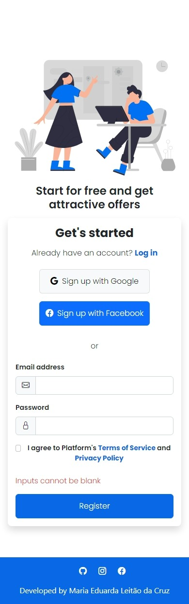

# 💻 Página de cadastro

## Tabela de conteúdos

- Sobre
    - Projeto
    - Funcionalidades
    - Screenshot
- Meu processo
    - Tecnologias
    - Ferramentas de desenvolvimento
    - Fontes úteis
- Aprendizado
- Autor

## Sobre

### 📑 Projeto

Esse projeto é um formulário de cadastro feito em React.

[Acesse o site](https://mariamourie.github.io/signup-form/)

### ⚙️ Funcionalidades

Os usuários devem estar aptos a:

- Visualizar o layout de acordo com o tamanho de sua tela
- Visualizar o efeito hover para todos os elementos interativos.
- Visualizar mensagem sobre o preenchimento incorreto dos campos, caso tenha deixado um campo vazio.

### 📸 Screenshot

## Meu processo

### 🛠️ Tecnologias

- HTML
- CSS
- Javascript
- React
- Bootstrap

### 🛠️ Ferramentas de desenvolvimento

- Visual Studio Code
- Git Bash
- Node.js

### Fontes úteis

- [Repositório ensinando a fazer deploy de uma aplicação feita em React para o GitHub Pages](https://github.com/gitname/react-gh-pages)

## 📚 Aprendizado

Nesse projeto tive a oportunidade de relembrar e exercitar as tecnologias React e Bootstrap, recentemente tive módulos dessas tecnologias no curso que estou fazendo de desenvolvimento web e senti a necessidade de fazer uma página web utilizando elas com o conhecimento que obtive. Com esse projeto, relembrei alguns conceitos de criação de componentes, state, react forms e classes do bootstrap.

## 📍 Autor

   <h3>Feito por Maria Eduarda Leitão da Cruz, Desenvolvedora Front-End</h3>

 

### 📲 Redes Sociais

 

 